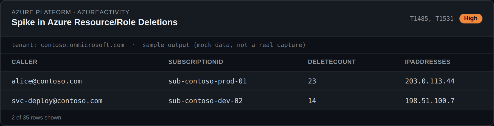
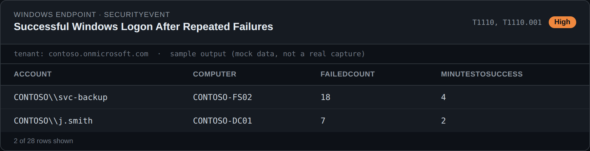
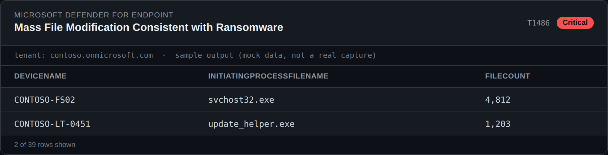
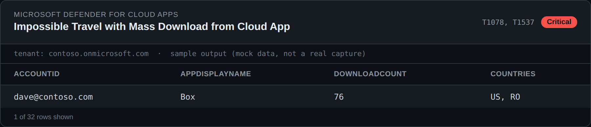

# Sentinel KQL Detection Library

A collection of KQL (Kusto Query Language) detection and hunting queries for Microsoft Sentinel, organized by data source.

## Detections

| Data Source | Description |
|---|---|
| [Entra ID](detections/entra-id/README.md) | Authentication monitoring, suspicious activities, privileged access, account management, conditional access, risky sign-ins, and application/service principal activity. Each query maps to MITRE ATT&CK techniques with severity and false-positive guidance. |
| [Top 20 — Microsoft Ecosystem](detections/top-20-microsoft-ecosystem/README.md) | A curated cross-product set spanning Azure infrastructure, network telemetry, Windows endpoints, Microsoft Defender for Endpoint, Microsoft 365, Defender for Cloud Apps, and Defender for Identity. Includes sample output mockups for each query. |

## Sample Output

Illustrative mockups of query output (fictitious `contoso.com` sample data — not real captures):

| | |
|---|---|
|  |  |
|  |  |

See the [full gallery of all 20 queries](detections/top-20-microsoft-ecosystem/README.md#queries) for the rest.

## Usage

Each data source folder contains:
- A `README.md` describing the queries, their MITRE ATT&CK mappings, and usage guidance.
- A `kql-queries/` folder with the individual `.kql` files, ready to paste into Microsoft Sentinel Logs or use as the basis for scheduled analytics rules.

## License

MIT — see [LICENSE](LICENSE).
