# Top 20 KQL Queries — Threat Detection Across the Microsoft Ecosystem

A curated set of 20 Microsoft Sentinel KQL detection/hunting queries spanning Azure infrastructure, network telemetry, Windows endpoints, Microsoft Defender for Endpoint, Microsoft 365, Microsoft Defender for Cloud Apps, and Microsoft Defender for Identity — one detection per query, each mapped to a MITRE ATT&CK technique.

All example identities, hostnames, and resource names below use the fictitious `contoso.com` domain. The screenshot under each query is a **generated mockup of expected output** for illustration — it is not a real captured screenshot from a live Sentinel workspace.

## Queries

| # | Query | Data Source | MITRE ATT&CK | Severity |
|---|---|---|---|---|
| 01 | [Spike in Azure Resource/Role Deletions](kql-queries/01-azure-resource-deletion-spike.kql) | AzureActivity | T1485, T1531 | High |
| 02 | [Privileged Role Assignment Outside Business Hours](kql-queries/02-privileged-role-assignment-after-hours.kql) | AzureActivity | T1098.003 | High |
| 03 | [Anomalous Secret/Key Access Volume](kql-queries/03-keyvault-secret-access-spike.kql) | Key Vault (AzureDiagnostics) | T1552.001, T1528 | High |
| 04 | [Anonymous/Public Access to Storage Container](kql-queries/04-storage-public-access-exposure.kql) | StorageBlobLogs | T1530 | Critical |
| 05 | [Brute Force Against Azure SQL Server](kql-queries/05-sql-bruteforce-login.kql) | Azure SQL (AzureDiagnostics) | T1110 | High |
| 06 | [Internal Port Scanning via NSG Flow Logs](kql-queries/06-nsg-internal-port-scan.kql) | AzureNetworkAnalytics_CL | T1046 | Medium |
| 07 | [Spike in Denied Outbound Connections](kql-queries/07-firewall-denied-traffic-spike.kql) | Azure Firewall (AzureDiagnostics) | T1071, T1595 | Medium |
| 08 | [Query to Newly Observed / Malicious Domain](kql-queries/08-dns-malicious-domain-query.kql) | DnsEvents | T1071.004, T1568 | Medium |
| 09 | [Successful Windows Logon After Repeated Failures](kql-queries/09-windows-failed-logon-then-success.kql) | SecurityEvent | T1110, T1110.001 | High |
| 10 | [New Member Added to Privileged Group](kql-queries/10-windows-privileged-group-membership-change.kql) | SecurityEvent | T1098, T1078.003 | Critical |
| 11 | [Suspicious Encoded PowerShell Command Line](kql-queries/11-windows-encoded-powershell-process.kql) | SecurityEvent | T1059.001, T1027 | High |
| 12 | [Encoded/Obfuscated PowerShell Execution (MDE)](kql-queries/12-mde-encoded-powershell-execution.kql) | DeviceProcessEvents | T1059.001, T1027 | High |
| 13 | [Rare Outbound Connection to Uncommon Port/IP](kql-queries/13-mde-rare-outbound-connection.kql) | DeviceNetworkEvents | T1071, T1571 | Medium |
| 14 | [Mass File Modification Consistent with Ransomware](kql-queries/14-mde-mass-file-modification-ransomware.kql) | DeviceFileEvents | T1486 | Critical |
| 15 | [Lateral Movement via Multiple Host Logons](kql-queries/15-mde-lateral-movement-multiple-logons.kql) | DeviceLogonEvents | T1021, T1078 | High |
| 16 | [Suspicious Inbox Forwarding Rule Creation](kql-queries/16-o365-inbox-forwarding-rule.kql) | OfficeActivity (Exchange Online) | T1114.003 | High |
| 17 | [Mass File Download Consistent with Exfiltration](kql-queries/17-o365-mass-file-download-exfiltration.kql) | OfficeActivity (SharePoint/OneDrive) | T1530, T1030 | High |
| 18 | [External Domain File Sharing Spike (Teams)](kql-queries/18-teams-external-file-sharing-spike.kql) | OfficeActivity (Teams) | T1567 | Medium |
| 19 | [Impossible Travel with Mass Download from Cloud App](kql-queries/19-mcas-impossible-travel-mass-download.kql) | CloudAppEvents (Defender for Cloud Apps) | T1078, T1537 | Critical |
| 20 | [Suspicious Directory Replication (DCSync) Activity](kql-queries/20-mdi-suspicious-dcsync-activity.kql) | IdentityDirectoryEvents (Defender for Identity) | T1003.006 | Critical |

---

### 01. Spike in Azure Resource/Role Deletions

### 02. Privileged Role Assignment Outside Business Hours
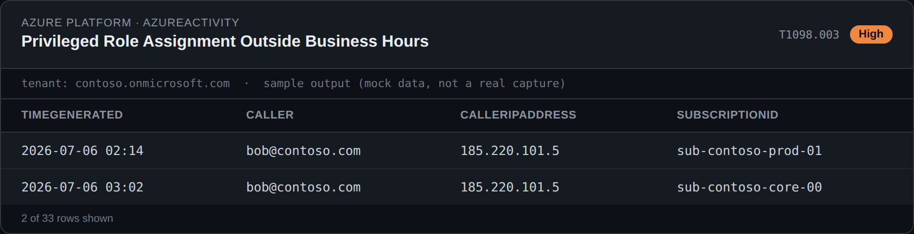

### 03. Anomalous Secret/Key Access Volume
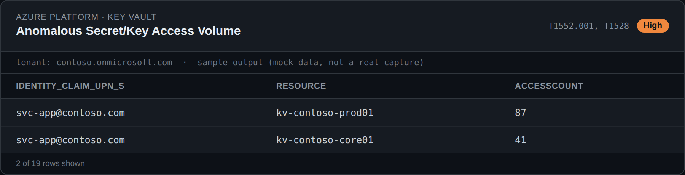

### 04. Anonymous/Public Access to Storage Container
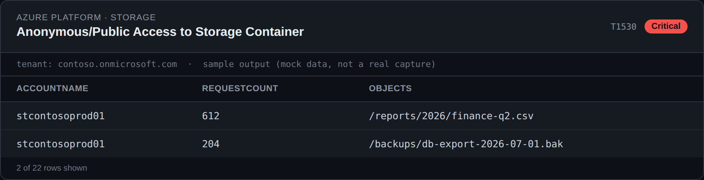

### 05. Brute Force Against Azure SQL Server
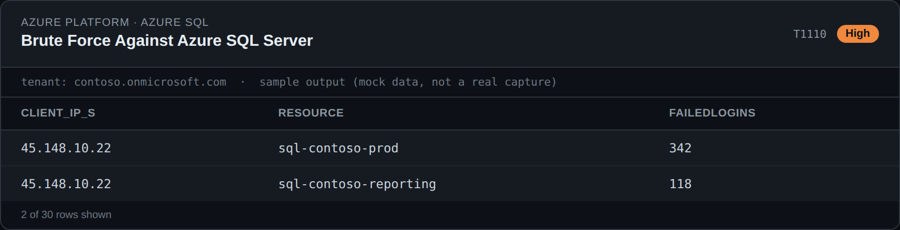

### 06. Internal Port Scanning via NSG Flow Logs
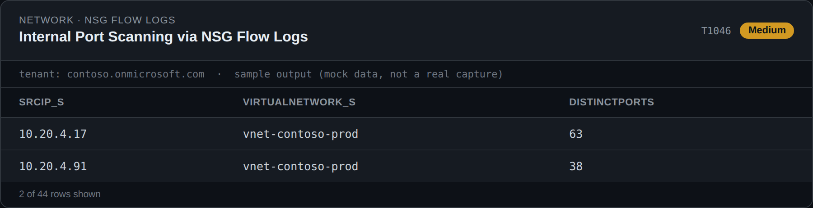

### 07. Spike in Denied Outbound Connections
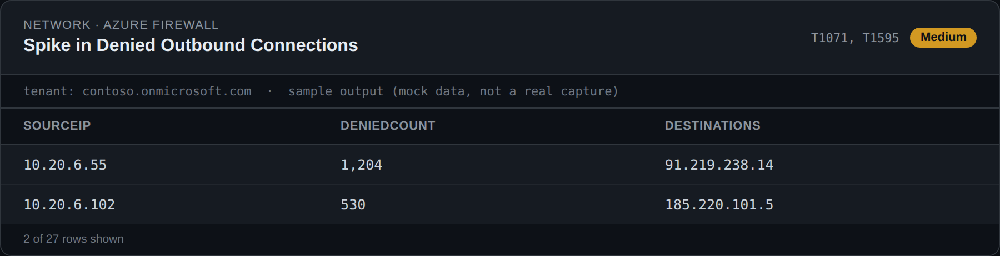

### 08. Query to Newly Observed / Malicious Domain
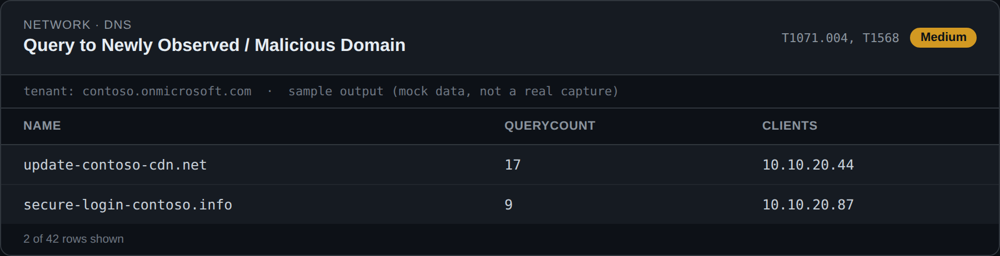

### 09. Successful Windows Logon After Repeated Failures

### 10. New Member Added to Privileged Group
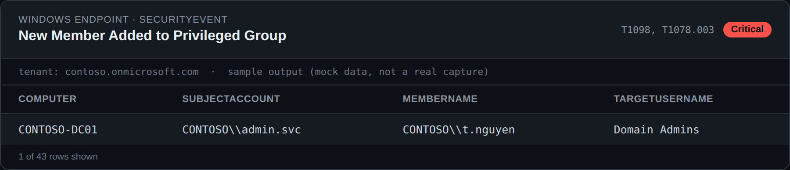

### 11. Suspicious Encoded PowerShell Command Line
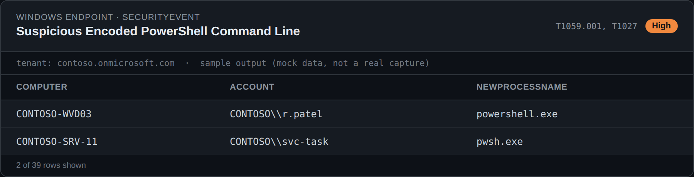

### 12. Encoded/Obfuscated PowerShell Execution (MDE)
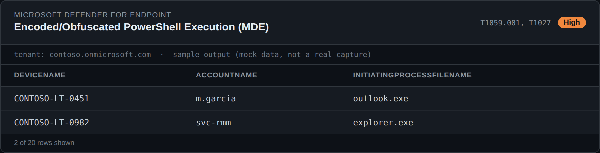

### 13. Rare Outbound Connection to Uncommon Port/IP
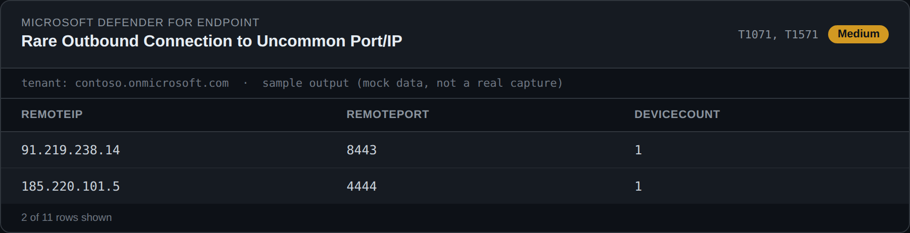

### 14. Mass File Modification Consistent with Ransomware

### 15. Lateral Movement via Multiple Host Logons
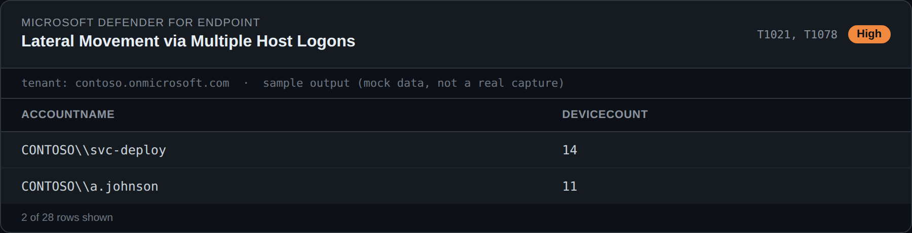

### 16. Suspicious Inbox Forwarding Rule Creation
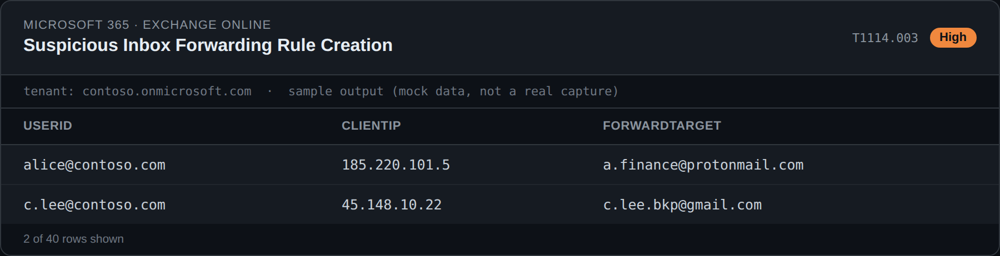

### 17. Mass File Download Consistent with Exfiltration
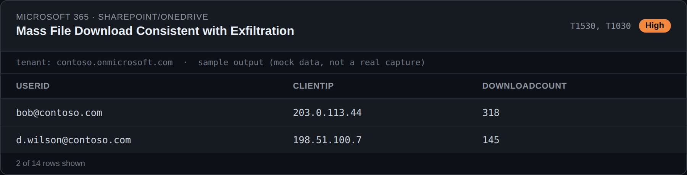

### 18. External Domain File Sharing Spike (Teams)
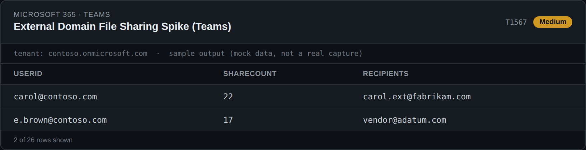

### 19. Impossible Travel with Mass Download from Cloud App

### 20. Suspicious Directory Replication (DCSync) Activity
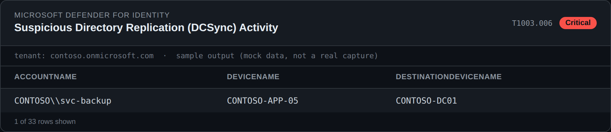

## Usage

Each `.kql` file follows the same documentation convention as the rest of this library: a file-level header plus, per query, a description, use case, MITRE ATT&CK mapping, severity, false-positive rate, expected output, common false positives, and tuning recommendations. Paste a query into **Microsoft Sentinel → Logs**, adjust the time range and thresholds for your environment, then promote it to a scheduled analytics rule once validated.

## Disclaimer

These queries are examples for security monitoring and threat detection. Test thoroughly in your own environment, tune thresholds against your baseline, and validate results before taking action.
